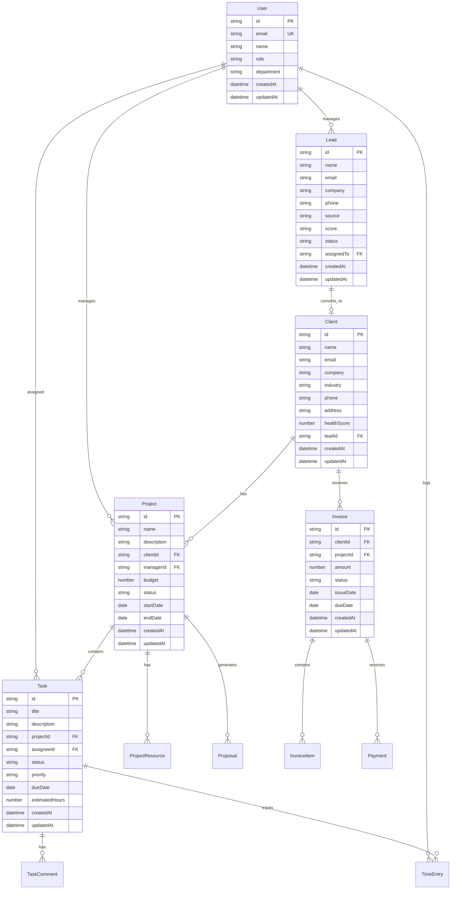

# AgencyCRM - Database Schema Documentation

## 1. Database Overview

The AgencyCRM system uses PostgreSQL as the primary database with Prisma ORM for type-safe database operations. The schema is designed to support comprehensive agency management including leads, clients, projects, tasks, team management, and financial operations.

## 2. Entity Relationship Diagram



## 3. Core Tables Definition

### 3.1 User Management Tables

**Users Table**
```sql
CREATE TABLE users (
    id UUID PRIMARY KEY DEFAULT gen_random_uuid(),
    email VARCHAR(255) UNIQUE NOT NULL,
    password_hash VARCHAR(255) NOT NULL,
    name VARCHAR(100) NOT NULL,
    role VARCHAR(20) DEFAULT 'member' CHECK (role IN ('admin', 'manager', 'member', 'client')),
    department VARCHAR(50),
    phone VARCHAR(20),
    avatar_url TEXT,
    is_active BOOLEAN DEFAULT true,
    last_login TIMESTAMP WITH TIME ZONE,
    created_at TIMESTAMP WITH TIME ZONE DEFAULT NOW(),
    updated_at TIMESTAMP WITH TIME ZONE DEFAULT NOW()
);

CREATE INDEX idx_users_email ON users(email);
CREATE INDEX idx_users_role ON users(role);
CREATE INDEX idx_users_active ON users(is_active);
```

### 3.2 Lead Management Tables

**Leads Table**
```sql
CREATE TABLE leads (
    id UUID PRIMARY KEY DEFAULT gen_random_uuid(),
    name VARCHAR(100) NOT NULL,
    email VARCHAR(255) NOT NULL,
    company VARCHAR(100),
    phone VARCHAR(20),
    source VARCHAR(50) NOT NULL CHECK (source IN ('website', 'social', 'referral', 'email', 'cold_call')),
    score VARCHAR(10) DEFAULT 'cold' CHECK (score IN ('hot', 'warm', 'cold')),
    status VARCHAR(20) DEFAULT 'new' CHECK (status IN ('new', 'contacted', 'qualified', 'proposal_sent', 'negotiation', 'converted', 'lost')),
    assigned_to UUID REFERENCES users(id),
    notes TEXT,
    converted_to_client_id UUID,
    created_at TIMESTAMP WITH TIME ZONE DEFAULT NOW(),
    updated_at TIMESTAMP WITH TIME ZONE DEFAULT NOW()
);

CREATE INDEX idx_leads_status ON leads(status);
CREATE INDEX idx_leads_score ON leads(score);
CREATE INDEX idx_leads_assigned ON leads(assigned_to);
CREATE INDEX idx_leads_created ON leads(created_at DESC);
```

**Lead Interactions Table**
```sql
CREATE TABLE lead_interactions (
    id UUID PRIMARY KEY DEFAULT gen_random_uuid(),
    lead_id UUID NOT NULL REFERENCES leads(id) ON DELETE CASCADE,
    user_id UUID NOT NULL REFERENCES users(id),
    interaction_type VARCHAR(20) NOT NULL CHECK (interaction_type IN ('call', 'email', 'meeting', 'note')),
    subject VARCHAR(200),
    content TEXT,
    scheduled_at TIMESTAMP WITH TIME ZONE,
    completed_at TIMESTAMP WITH TIME ZONE,
    created_at TIMESTAMP WITH TIME ZONE DEFAULT NOW()
);

CREATE INDEX idx_lead_interactions_lead ON lead_interactions(lead_id);
CREATE INDEX idx_lead_interactions_date ON lead_interactions(created_at DESC);
```

### 3.3 Client Management Tables

**Clients Table**
```sql
CREATE TABLE clients (
    id UUID PRIMARY KEY DEFAULT gen_random_uuid(),
    name VARCHAR(100) NOT NULL,
    email VARCHAR(255) NOT NULL,
    company VARCHAR(100) NOT NULL,
    industry VARCHAR(50),
    phone VARCHAR(20),
    address TEXT,
    website VARCHAR(255),
    health_score INTEGER DEFAULT 5 CHECK (health_score >= 1 AND health_score <= 10),
    lead_id UUID REFERENCES leads(id),
    account_manager_id UUID REFERENCES users(id),
    created_at TIMESTAMP WITH TIME ZONE DEFAULT NOW(),
    updated_at TIMESTAMP WITH TIME ZONE DEFAULT NOW()
);

CREATE INDEX idx_clients_company ON clients(company);
CREATE INDEX idx_clients_health ON clients(health_score);
CREATE INDEX idx_clients_manager ON clients(account_manager_id);
```

**Client Contacts Table**
```sql
CREATE TABLE client_contacts (
    id UUID PRIMARY KEY DEFAULT gen_random_uuid(),
    client_id UUID NOT NULL REFERENCES clients(id) ON DELETE CASCADE,
    name VARCHAR(100) NOT NULL,
    email VARCHAR(255),
    phone VARCHAR(20),
    position VARCHAR(100),
    is_primary BOOLEAN DEFAULT false,
    created_at TIMESTAMP WITH TIME ZONE DEFAULT NOW()
);

CREATE INDEX idx_client_contacts_client ON client_contacts(client_id);
CREATE INDEX idx_client_contacts_primary ON client_contacts(is_primary);
```

### 3.4 Project Management Tables

**Projects Table**
```sql
CREATE TABLE projects (
    id UUID PRIMARY KEY DEFAULT gen_random_uuid(),
    name VARCHAR(200) NOT NULL,
    description TEXT,
    client_id UUID NOT NULL REFERENCES clients(id),
    manager_id UUID NOT NULL REFERENCES users(id),
    budget DECIMAL(12,2),
    status VARCHAR(20) DEFAULT 'planning' CHECK (status IN ('planning', 'active', 'on_hold', 'completed', 'cancelled')),
    priority VARCHAR(10) DEFAULT 'medium' CHECK (priority IN ('low', 'medium', 'high', 'urgent')),
    start_date DATE,
    end_date DATE,
    completion_percentage INTEGER DEFAULT 0 CHECK (completion_percentage >= 0 AND completion_percentage <= 100),
    created_at TIMESTAMP WITH TIME ZONE DEFAULT NOW(),
    updated_at TIMESTAMP WITH TIME ZONE DEFAULT NOW()
);

CREATE INDEX idx_projects_client ON projects(client_id);
CREATE INDEX idx_projects_manager ON projects(manager_id);
CREATE INDEX idx_projects_status ON projects(status);
CREATE INDEX idx_projects_dates ON projects(start_date, end_date);
```

**Project Resources Table**
```sql
CREATE TABLE project_resources (
    id UUID PRIMARY KEY DEFAULT gen_random_uuid(),
    project_id UUID NOT NULL REFERENCES projects(id) ON DELETE CASCADE,
    name VARCHAR(200) NOT NULL,
    type VARCHAR(20) NOT NULL CHECK (type IN ('link', 'file', 'document', 'research')),
    url TEXT,
    file_path TEXT,
    description TEXT,
    created_by UUID NOT NULL REFERENCES users(id),
    created_at TIMESTAMP WITH TIME ZONE DEFAULT NOW()
);

CREATE INDEX idx_project_resources_project ON project_resources(project_id);
CREATE INDEX idx_project_resources_type ON project_resources(type);
```

### 3.5 Task Management Tables

**Tasks Table**
```sql
CREATE TABLE tasks (
    id UUID PRIMARY KEY DEFAULT gen_random_uuid(),
    title VARCHAR(200) NOT NULL,
    description TEXT,
    project_id UUID NOT NULL REFERENCES projects(id),
    assignee_id UUID REFERENCES users(id),
    created_by UUID NOT NULL REFERENCES users(id),
    status VARCHAR(20) DEFAULT 'todo' CHECK (status IN ('todo', 'in_progress', 'in_review', 'done', 'cancelled')),
    priority VARCHAR(10) DEFAULT 'medium' CHECK (priority IN ('low', 'medium', 'high', 'urgent')),
    due_date DATE,
    estimated_hours DECIMAL(5,2),
    actual_hours DECIMAL(5,2) DEFAULT 0,
    completion_percentage INTEGER DEFAULT 0 CHECK (completion_percentage >= 0 AND completion_percentage <= 100),
    created_at TIMESTAMP WITH TIME ZONE DEFAULT NOW(),
    updated_at TIMESTAMP WITH TIME ZONE DEFAULT NOW()
);

CREATE INDEX idx_tasks_project ON tasks(project_id);
CREATE INDEX idx_tasks_assignee ON tasks(assignee_id);
CREATE INDEX idx_tasks_status ON tasks(status);
CREATE INDEX idx_tasks_due_date ON tasks(due_date);
CREATE INDEX idx_tasks_priority ON tasks(priority);
```

**Task Comments Table**
```sql
CREATE TABLE task_comments (
    id UUID PRIMARY KEY DEFAULT gen_random_uuid(),
    task_id UUID NOT NULL REFERENCES tasks(id) ON DELETE CASCADE,
    user_id UUID NOT NULL REFERENCES users(id),
    content TEXT NOT NULL,
    created_at TIMESTAMP WITH TIME ZONE DEFAULT NOW()
);

CREATE INDEX idx_task_comments_task ON task_comments(task_id);
CREATE INDEX idx_task_comments_date ON task_comments(created_at DESC);
```

**Time Entries Table**
```sql
CREATE TABLE time_entries (
    id UUID PRIMARY KEY DEFAULT gen_random_uuid(),
    task_id UUID NOT NULL REFERENCES tasks(id),
    user_id UUID NOT NULL REFERENCES users(id),
    hours DECIMAL(5,2) NOT NULL CHECK (hours > 0),
    description TEXT,
    date DATE NOT NULL,
    created_at TIMESTAMP WITH TIME ZONE DEFAULT NOW()
);

CREATE INDEX idx_time_entries_task ON time_entries(task_id);
CREATE INDEX idx_time_entries_user ON time_entries(user_id);
CREATE INDEX idx_time_entries_date ON time_entries(date DESC);
```

### 3.6 Financial Management Tables

**Proposals Table**
```sql
CREATE TABLE proposals (
    id UUID PRIMARY KEY DEFAULT gen_random_uuid(),
    client_id UUID NOT NULL REFERENCES clients(id),
    project_id UUID REFERENCES projects(id),
    title VARCHAR(200) NOT NULL,
    content TEXT,
    total_amount DECIMAL(12,2) NOT NULL,
    status VARCHAR(20) DEFAULT 'draft' CHECK (status IN ('draft', 'sent', 'viewed', 'accepted', 'rejected', 'expired')),
    valid_until DATE,
    created_by UUID NOT NULL REFERENCES users(id),
    created_at TIMESTAMP WITH TIME ZONE DEFAULT NOW(),
    updated_at TIMESTAMP WITH TIME ZONE DEFAULT NOW()
);

CREATE INDEX idx_proposals_client ON proposals(client_id);
CREATE INDEX idx_proposals_status ON proposals(status);
CREATE INDEX idx_proposals_date ON proposals(created_at DESC);
```

**Invoices Table**
```sql
CREATE TABLE invoices (
    id UUID PRIMARY KEY DEFAULT gen_random_uuid(),
    invoice_number VARCHAR(50) UNIQUE NOT NULL,
    client_id UUID NOT NULL REFERENCES clients(id),
    project_id UUID REFERENCES projects(id),
    proposal_id UUID REFERENCES proposals(id),
    amount DECIMAL(12,2) NOT NULL,
    tax_amount DECIMAL(12,2) DEFAULT 0,
    total_amount DECIMAL(12,2) NOT NULL,
    status VARCHAR(20) DEFAULT 'draft' CHECK (status IN ('draft', 'sent', 'paid', 'overdue', 'cancelled')),
    issue_date DATE NOT NULL,
    due_date DATE NOT NULL,
    paid_date DATE,
    notes TEXT,
    created_by UUID NOT NULL REFERENCES users(id),
    created_at TIMESTAMP WITH TIME ZONE DEFAULT NOW(),
    updated_at TIMESTAMP WITH TIME ZONE DEFAULT NOW()
);

CREATE INDEX idx_invoices_client ON invoices(client_id);
CREATE INDEX idx_invoices_status ON invoices(status);
CREATE INDEX idx_invoices_due_date ON invoices(due_date);
CREATE INDEX idx_invoices_number ON invoices(invoice_number);
```

**Invoice Items Table**
```sql
CREATE TABLE invoice_items (
    id UUID PRIMARY KEY DEFAULT gen_random_uuid(),
    invoice_id UUID NOT NULL REFERENCES invoices(id) ON DELETE CASCADE,
    description VARCHAR(500) NOT NULL,
    quantity DECIMAL(8,2) NOT NULL DEFAULT 1,
    unit_price DECIMAL(10,2) NOT NULL,
    total_price DECIMAL(12,2) NOT NULL,
    created_at TIMESTAMP WITH TIME ZONE DEFAULT NOW()
);

CREATE INDEX idx_invoice_items_invoice ON invoice_items(invoice_id);
```

**Payments Table**
```sql
CREATE TABLE payments (
    id UUID PRIMARY KEY DEFAULT gen_random_uuid(),
    invoice_id UUID NOT NULL REFERENCES invoices(id),
    amount DECIMAL(12,2) NOT NULL,
    payment_method VARCHAR(50),
    transaction_id VARCHAR(100),
    payment_date DATE NOT NULL,
    notes TEXT,
    created_at TIMESTAMP WITH TIME ZONE DEFAULT NOW()
);

CREATE INDEX idx_payments_invoice ON payments(invoice_id);
CREATE INDEX idx_payments_date ON payments(payment_date DESC);
```

### 3.7 System Tables

**Notifications Table**
```sql
CREATE TABLE notifications (
    id UUID PRIMARY KEY DEFAULT gen_random_uuid(),
    user_id UUID NOT NULL REFERENCES users(id),
    title VARCHAR(200) NOT NULL,
    message TEXT NOT NULL,
    type VARCHAR(20) NOT NULL CHECK (type IN ('info', 'success', 'warning', 'error')),
    is_read BOOLEAN DEFAULT false,
    action_url TEXT,
    created_at TIMESTAMP WITH TIME ZONE DEFAULT NOW()
);

CREATE INDEX idx_notifications_user ON notifications(user_id);
CREATE INDEX idx_notifications_read ON notifications(is_read);
CREATE INDEX idx_notifications_date ON notifications(created_at DESC);
```

**System Settings Table**
```sql
CREATE TABLE system_settings (
    id UUID PRIMARY KEY DEFAULT gen_random_uuid(),
    key VARCHAR(100) UNIQUE NOT NULL,
    value TEXT,
    description TEXT,
    updated_by UUID REFERENCES users(id),
    updated_at TIMESTAMP WITH TIME ZONE DEFAULT NOW()
);

CREATE INDEX idx_system_settings_key ON system_settings(key);
```

## 4. Initial Data Setup

### 4.1 Default User Roles
```sql
-- Create default admin user
INSERT INTO users (email, password_hash, name, role) VALUES 
('admin@agencycrm.com', '$2b$10$encrypted_password_hash', 'System Administrator', 'admin');

-- Create sample departments
INSERT INTO system_settings (key, value, description) VALUES 
('departments', '["Creative", "Strategy", "Development", "Account Management", "Finance"]', 'Available departments'),
('lead_sources', '["Website", "Social Media", "Referral", "Email Campaign", "Cold Call", "Event"]', 'Available lead sources'),
('project_types', '["Branding", "Web Development", "Digital Marketing", "Content Creation", "SEO", "Social Media Management"]', 'Available project types');
```

### 4.2 Sample Data for Testing
```sql
-- Sample client
INSERT INTO clients (name, email, company, industry, phone, health_score) VALUES 
('John Smith', 'john@techstartup.com', 'Tech Startup Inc', 'Technology', '+1-555-0123', 8);

-- Sample project
INSERT INTO projects (name, description, client_id, manager_id, budget, status, start_date, end_date) VALUES 
('Brand Identity Redesign', 'Complete brand identity overhaul including logo, colors, and guidelines', 
 (SELECT id FROM clients WHERE email = 'john@techstartup.com'), 
 (SELECT id FROM users WHERE role = 'admin'), 
 15000.00, 'active', CURRENT_DATE, CURRENT_DATE + INTERVAL '60 days');
```

## 5. Database Optimization

### 5.1 Performance Indexes
```sql
-- Composite indexes for common queries
CREATE INDEX idx_tasks_project_status ON tasks(project_id, status);
CREATE INDEX idx_time_entries_user_date ON time_entries(user_id, date DESC);
CREATE INDEX idx_invoices_client_status ON invoices(client_id, status);
CREATE INDEX idx_leads_assigned_status ON leads(assigned_to, status);
```

### 5.2 Database Constraints
```sql
-- Ensure invoice totals are calculated correctly
ALTER TABLE invoices ADD CONSTRAINT check_total_amount 
CHECK (total_amount = amount + tax_amount);

-- Ensure project dates are logical
ALTER TABLE projects ADD CONSTRAINT check_project_dates 
CHECK (end_date IS NULL OR start_date IS NULL OR end_date >= start_date);

-- Ensure task completion percentage matches status
ALTER TABLE tasks ADD CONSTRAINT check_completion_status 
CHECK ((status = 'done' AND completion_percentage = 100) OR status != 'done');
```

This database schema provides a comprehensive foundation for the AgencyCRM system, supporting all core functionalities while maintaining data integrity and performance optimization.