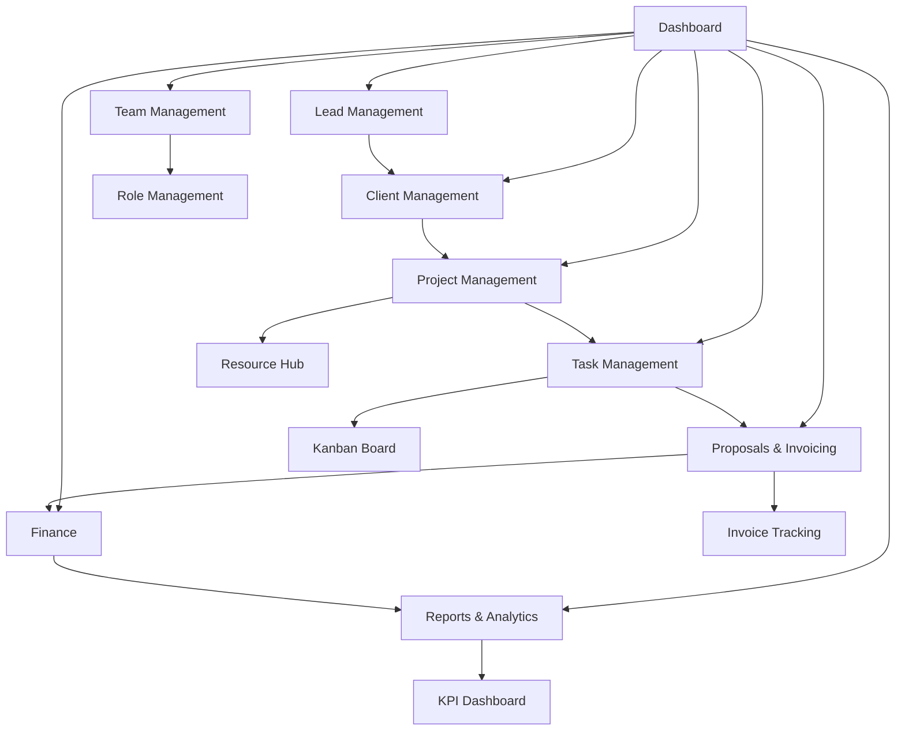

# AgencyCRM - Product Requirements Document

## 1. Product Overview
AgencyCRM is an integrated management system designed specifically for branding and marketing agencies, unifying all processes from lead generation to project delivery and financial reporting on a single platform.
- The system addresses the need for streamlined data management, enhanced team collaboration, and strategic decision-making clarity for marketing agencies.
- Target market: Small to medium-sized branding and marketing agencies seeking to optimize operations and drive profitable growth through data-driven insights.

## 2. Core Features

### 2.1 User Roles
| Role | Registration Method | Core Permissions |
|------|---------------------|------------------|
| Admin | System setup/invitation | Full system access, user management, financial data |
| Project Manager | Admin invitation | Project creation, team assignment, client management |
| Team Member | Admin/PM invitation | Task management, time tracking, project collaboration |
| Client | Invitation-based | View project progress, approve deliverables, communication |

### 2.2 Feature Module
Our AgencyCRM system consists of the following main pages:
1. **Dashboard**: Overview metrics, recent activities, quick actions, notifications panel
2. **Lead Management**: Lead capture forms, scoring system, nurturing pipeline, conversion tracking
3. **Client Management**: Client profiles, contact management, interaction history, health scores
4. **Project Management**: Project creation, resource hub, template management, progress tracking
5. **Task Management**: Kanban boards, task assignment, time tracking, collaboration tools
6. **Team Management**: Employee profiles, role management, attendance tracking, performance monitoring
7. **Proposals & Invoicing**: Proposal builder, invoice generation, payment tracking, recurring billing
8. **Finance**: Revenue tracking, expense management, profitability analysis, financial dashboard
9. **Reports & Analytics**: Client reports, team performance, business insights, KPI tracking
10. **Settings**: System configuration, user preferences, integrations, security settings

### 2.3 Page Details
| Page Name | Module Name | Feature description |
|-----------|-------------|---------------------|
| Dashboard | Overview Panel | Display key metrics, recent activities, pending tasks, and quick action buttons for common operations |
| Dashboard | Notification Center | Show system alerts, task reminders, payment notifications, and team updates with priority indicators |
| Lead Management | Lead Capture | Integrate forms from multiple channels (website, social media, email campaigns) with automatic data collection |
| Lead Management | Lead Scoring | Implement automated scoring system (Hot/Warm/Cold) based on engagement metrics and lead behavior |
| Lead Management | Nurturing Pipeline | Track lead stages (New, Contacted, Proposal Sent, Negotiation) with automated follow-up reminders |
| Lead Management | Communication Log | Maintain detailed interaction history including emails, calls, meetings with timestamps |
| Lead Management | Lead Conversion | One-click conversion to client with automatic data transfer and history preservation |
| Client Management | Client Dashboard | Comprehensive client overview with current projects, key metrics, and relationship status |
| Client Management | Client Profiles | Store company details, industry information, contact data, and custom notes |
| Client Management | Contact Management | Manage multiple contacts per client organization with role definitions |
| Client Management | Health Scoring | Calculate client satisfaction scores and identify at-risk accounts for proactive management |
| Project Management | Project Creation | Create projects with scope definition, budget allocation, deadline setting, and detailed descriptions |
| Project Management | Project Dashboard | Visual project overview using Kanban boards and list views with status tracking |
| Project Management | Resource Hub | Centralized storage for project links (Google Drive, Figma, Dropbox), files, and research materials |
| Project Management | Template System | Create and utilize pre-built templates for recurring project types |
| Task Management | Task Creation | Create detailed tasks with descriptions, due dates, priority levels, and assignment capabilities |
| Task Management | Kanban Board | Visual workflow management with customizable stages (To-Do, In Progress, In Review, Done) |
| Task Management | Time Tracking | Log time spent on tasks for profitability analysis and productivity monitoring |
| Task Management | Activity History | Complete audit trail of task actions with timestamps and user attribution |
| Task Management | Collaboration Tools | Comment sections, file attachments, and reference links for team communication |
| Team Management | Employee Profiles | Central directory with personal details, job titles, contact information, and skill sets |
| Team Management | Role-Based Access | Define user permissions and system access levels based on organizational roles |
| Team Management | Attendance System | Digital attendance tracking and leave request management with approval workflows |
| Team Management | Performance Monitoring | Track individual productivity, task completion rates, and project contributions |
| Proposals & Invoicing | Proposal Builder | Create professional proposals using customizable templates with branding elements |
| Proposals & Invoicing | Invoice Generation | Automated invoice creation based on project milestones or retainer agreements |
| Proposals & Invoicing | Payment Tracking | Monitor invoice status (Paid, Unpaid, Overdue) with automated reminder systems |
| Proposals & Invoicing | Recurring Billing | Set up automated monthly retainer invoicing for ongoing client relationships |
| Finance | Financial Dashboard | Visual display of revenue, expenses, profit margins with monthly/quarterly/annual views |
| Finance | Revenue Tracking | Log incoming payments and link to specific clients and projects for accurate reporting |
| Finance | Expense Management | Categorize and track business expenses with detailed reporting capabilities |
| Finance | Profitability Analysis | Calculate project and service-wise profit margins with comparative analysis |
| Reports & Analytics | Client Reporting | Generate automated progress reports for clients with customizable frequency |
| Reports & Analytics | Team Performance | Create productivity reports with task completion rates and efficiency metrics |
| Reports & Analytics | Business Insights | Track KPIs including lead conversion rates, client retention, and average project value |
| Reports & Analytics | Monthly Planning | Data-driven strategic planning tools for upcoming month preparation |

## 3. Core Process

**Admin Flow:**
Admin users start from the dashboard to monitor overall system health, then navigate to team management for user administration, access financial modules for business oversight, and configure system settings for optimal operation.

**Project Manager Flow:**
Project managers begin with the dashboard overview, proceed to lead management for prospect conversion, create and manage projects in the project module, assign tasks to team members, and generate proposals and invoices for clients.

**Team Member Flow:**
Team members access their dashboard for task overview, navigate to assigned projects for context, manage individual tasks through the Kanban board, track time spent on activities, and collaborate through task comments and file sharing.

**Client Flow:**
Clients log in to view project progress, review deliverables, communicate with the project team, and access reports specific to their projects.

## 4. User Interface Design

### 4.1 Design Style
- **Primary Colors**: Deep blue (#1e40af) for headers and primary actions, light blue (#3b82f6) for secondary elements
- **Secondary Colors**: Gray scale (#f8fafc to #1e293b) for backgrounds and text, green (#10b981) for success states, red (#ef4444) for alerts
- **Button Style**: Rounded corners (8px radius) with subtle shadows, hover states with color transitions
- **Font**: Inter font family with 14px base size, 16px for headings, 12px for secondary text
- **Layout Style**: Card-based design with clean spacing, top navigation with sidebar for main modules
- **Icons**: Heroicons for consistency, with 20px standard size and 24px for primary actions

### 4.2 Page Design Overview
| Page Name | Module Name | UI Elements |
|-----------|-------------|-------------|
| Dashboard | Overview Panel | Grid layout with metric cards, chart components using Chart.js, color-coded status indicators |
| Dashboard | Navigation | Top navigation bar with logo, user profile dropdown, notification bell with badge counter |
| Lead Management | Pipeline View | Horizontal scrolling pipeline with drag-and-drop functionality, progress indicators |
| Lead Management | Lead Cards | Compact cards with lead score badges, contact information, and quick action buttons |
| Project Management | Kanban Board | Column-based layout with drag-and-drop, progress bars, team member avatars |
| Project Management | Resource Hub | Tabbed interface for links, files, and research with search and filter capabilities |
| Task Management | Task Cards | Detailed cards with priority indicators, due date badges, assignee avatars, and progress tracking |
| Team Management | Profile Grid | Card grid layout with profile photos, role badges, and quick contact options |
| Finance | Charts Dashboard | Interactive charts with drill-down capabilities, data tables with sorting and filtering |
| Reports | Report Builder | Form-based interface with preview pane, export options, and scheduling controls |

### 4.3 Responsiveness
The system is desktop-first with mobile-adaptive design, featuring responsive breakpoints at 768px and 1024px. Touch interaction optimization is implemented for mobile devices with larger touch targets and swipe gestures for navigation.