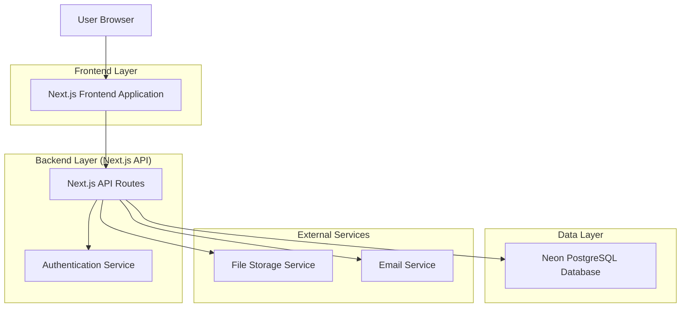
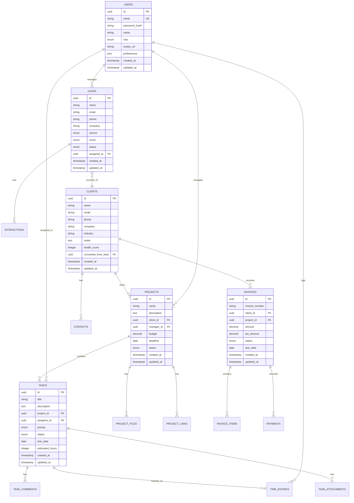

# AgencyCRM - Technical Architecture Document

## 1. Architecture Design



## 2. Technology Description

- **Frontend**: Next.js 14 + React 18 + TypeScript + Tailwind CSS + Shadcn/ui
- **Backend**: Next.js API Routes + NextAuth.js
- **Database**: Neon PostgreSQL + Prisma ORM
- **File Storage**: Uploadthing or AWS S3
- **Email Service**: Resend or SendGrid
- **Charts**: Chart.js or Recharts
- **Drag & Drop**: @dnd-kit/core
- **Forms**: React Hook Form + Zod validation

## 3. Route Definitions

| Route | Purpose |
|-------|---------|
| / | Dashboard home page with overview metrics and quick actions |
| /auth/signin | Authentication page with role-based login |
| /auth/signup | User registration page (admin-invited only) |
| /leads | Lead management dashboard with pipeline view |
| /leads/[id] | Individual lead detail page with interaction history |
| /clients | Client management overview with health scores |
| /clients/[id] | Detailed client profile with project history |
| /projects | Project management dashboard with Kanban view |
| /projects/[id] | Individual project detail with resource hub |
| /tasks | Task management with Kanban board interface |
| /tasks/[id] | Task detail page with collaboration tools |
| /team | Team management with employee profiles |
| /team/[id] | Individual team member profile and performance |
| /proposals | Proposal management and template builder |
| /proposals/[id] | Individual proposal editor and tracking |
| /invoices | Invoice management and payment tracking |
| /invoices/[id] | Invoice detail and payment history |
| /finance | Financial dashboard with revenue and expense tracking |
| /reports | Reports and analytics dashboard |
| /settings | System configuration and user preferences |

## 4. API Definitions

### 4.1 Authentication APIs

**User Authentication**
```
POST /api/auth/signin
```

Request:
| Param Name | Param Type | isRequired | Description |
|------------|------------|------------|-------------|
| email | string | true | User email address |
| password | string | true | User password |

Response:
| Param Name | Param Type | Description |
|------------|------------|-------------|
| user | object | User profile data |
| token | string | JWT authentication token |
| role | string | User role (admin, manager, member) |

### 4.2 Lead Management APIs

**Create Lead**
```
POST /api/leads
```

Request:
| Param Name | Param Type | isRequired | Description |
|------------|------------|------------|-------------|
| name | string | true | Lead name |
| email | string | true | Lead email |
| company | string | false | Company name |
| source | string | true | Lead source (website, social, referral) |
| score | enum | false | Lead score (hot, warm, cold) |

**Get Leads**
```
GET /api/leads
```

Query Parameters:
| Param Name | Param Type | Description |
|------------|------------|-------------|
| status | string | Filter by lead status |
| source | string | Filter by lead source |
| score | string | Filter by lead score |
| page | number | Pagination page number |
| limit | number | Items per page |

### 4.3 Project Management APIs

**Create Project**
```
POST /api/projects
```

Request:
| Param Name | Param Type | isRequired | Description |
|------------|------------|------------|-------------|
| name | string | true | Project name |
| clientId | string | true | Associated client ID |
| description | string | false | Project description |
| budget | number | false | Project budget |
| deadline | date | false | Project deadline |
| managerId | string | true | Project manager ID |

### 4.4 Task Management APIs

**Create Task**
```
POST /api/tasks
```

Request:
| Param Name | Param Type | isRequired | Description |
|------------|------------|------------|-------------|
| title | string | true | Task title |
| description | string | false | Task description |
| projectId | string | true | Associated project ID |
| assigneeId | string | false | Assigned team member ID |
| priority | enum | false | Task priority (high, medium, low) |
| dueDate | date | false | Task due date |
| status | enum | false | Task status (todo, progress, review, done) |

### 4.5 Financial APIs

**Create Invoice**
```
POST /api/invoices
```

Request:
| Param Name | Param Type | isRequired | Description |
|------------|------------|------------|-------------|
| clientId | string | true | Client ID |
| projectId | string | false | Associated project ID |
| amount | number | true | Invoice amount |
| dueDate | date | true | Payment due date |
| items | array | true | Invoice line items |

## 5. Server Architecture Diagram

```mermaid
graph TD
    A[Next.js API Routes] --> B[Authentication Middleware]
    B --> C[Route Handlers]
    C --> D[Business Logic Layer]
    D --> E[Data Access Layer (Prisma)]
    E --> F[(Neon PostgreSQL)]
    
    C --> G[File Upload Handler]
    C --> H[Email Service Handler]
    C --> I[Report Generator]
    
    subgraph "API Layer"
        A
        B
        C
    end
    
    subgraph "Business Layer"
        D
    end
    
    subgraph "Data Layer"
        E
        F
    end
    
    subgraph "Service Layer"
        G
        H
        I
    end
```

## 6. Data Model

### 6.1 Data Model Definition



### 6.2 Data Definition Language

**Users Table**
```sql
CREATE TABLE users (
    id UUID PRIMARY KEY DEFAULT gen_random_uuid(),
    email VARCHAR(255) UNIQUE NOT NULL,
    password_hash VARCHAR(255) NOT NULL,
    name VARCHAR(100) NOT NULL,
    role VARCHAR(20) DEFAULT 'member' CHECK (role IN ('admin', 'manager', 'member', 'client')),
    avatar_url TEXT,
    preferences JSONB DEFAULT '{}',
    created_at TIMESTAMP WITH TIME ZONE DEFAULT NOW(),
    updated_at TIMESTAMP WITH TIME ZONE DEFAULT NOW()
);

CREATE INDEX idx_users_email ON users(email);
CREATE INDEX idx_users_role ON users(role);
```

**Leads Table**
```sql
CREATE TABLE leads (
    id UUID PRIMARY KEY DEFAULT gen_random_uuid(),
    name VARCHAR(100) NOT NULL,
    email VARCHAR(255) NOT NULL,
    phone VARCHAR(20),
    company VARCHAR(100),
    source VARCHAR(50) NOT NULL CHECK (source IN ('website', 'social', 'referral', 'email', 'manual')),
    score VARCHAR(10) DEFAULT 'cold' CHECK (score IN ('hot', 'warm', 'cold')),
    status VARCHAR(20) DEFAULT 'new' CHECK (status IN ('new', 'contacted', 'proposal_sent', 'negotiation', 'converted', 'lost')),
    assigned_to UUID REFERENCES users(id),
    created_at TIMESTAMP WITH TIME ZONE DEFAULT NOW(),
    updated_at TIMESTAMP WITH TIME ZONE DEFAULT NOW()
);

CREATE INDEX idx_leads_status ON leads(status);
CREATE INDEX idx_leads_score ON leads(score);
CREATE INDEX idx_leads_assigned_to ON leads(assigned_to);
```

**Clients Table**
```sql
CREATE TABLE clients (
    id UUID PRIMARY KEY DEFAULT gen_random_uuid(),
    name VARCHAR(100) NOT NULL,
    email VARCHAR(255) NOT NULL,
    phone VARCHAR(20),
    company VARCHAR(100) NOT NULL,
    industry VARCHAR(50),
    notes TEXT,
    health_score INTEGER DEFAULT 5 CHECK (health_score >= 1 AND health_score <= 10),
    converted_from_lead UUID REFERENCES leads(id),
    created_at TIMESTAMP WITH TIME ZONE DEFAULT NOW(),
    updated_at TIMESTAMP WITH TIME ZONE DEFAULT NOW()
);

CREATE INDEX idx_clients_company ON clients(company);
CREATE INDEX idx_clients_health_score ON clients(health_score);
```

**Projects Table**
```sql
CREATE TABLE projects (
    id UUID PRIMARY KEY DEFAULT gen_random_uuid(),
    name VARCHAR(200) NOT NULL,
    description TEXT,
    client_id UUID NOT NULL REFERENCES clients(id),
    manager_id UUID NOT NULL REFERENCES users(id),
    budget DECIMAL(12,2),
    deadline DATE,
    status VARCHAR(20) DEFAULT 'planning' CHECK (status IN ('planning', 'active', 'on_hold', 'completed', 'cancelled')),
    created_at TIMESTAMP WITH TIME ZONE DEFAULT NOW(),
    updated_at TIMESTAMP WITH TIME ZONE DEFAULT NOW()
);

CREATE INDEX idx_projects_client_id ON projects(client_id);
CREATE INDEX idx_projects_manager_id ON projects(manager_id);
CREATE INDEX idx_projects_status ON projects(status);
```

**Tasks Table**
```sql
CREATE TABLE tasks (
    id UUID PRIMARY KEY DEFAULT gen_random_uuid(),
    title VARCHAR(200) NOT NULL,
    description TEXT,
    project_id UUID NOT NULL REFERENCES projects(id),
    assignee_id UUID REFERENCES users(id),
    priority VARCHAR(10) DEFAULT 'medium' CHECK (priority IN ('high', 'medium', 'low')),
    status VARCHAR(20) DEFAULT 'todo' CHECK (status IN ('todo', 'in_progress', 'in_review', 'done')),
    due_date DATE,
    estimated_hours INTEGER,
    created_at TIMESTAMP WITH TIME ZONE DEFAULT NOW(),
    updated_at TIMESTAMP WITH TIME ZONE DEFAULT NOW()
);

CREATE INDEX idx_tasks_project_id ON tasks(project_id);
CREATE INDEX idx_tasks_assignee_id ON tasks(assignee_id);
CREATE INDEX idx_tasks_status ON tasks(status);
CREATE INDEX idx_tasks_due_date ON tasks(due_date);
```

**Invoices Table**
```sql
CREATE TABLE invoices (
    id UUID PRIMARY KEY DEFAULT gen_random_uuid(),
    invoice_number VARCHAR(50) UNIQUE NOT NULL,
    client_id UUID NOT NULL REFERENCES clients(id),
    project_id UUID REFERENCES projects(id),
    amount DECIMAL(12,2) NOT NULL,
    tax_amount DECIMAL(12,2) DEFAULT 0,
    status VARCHAR(20) DEFAULT 'draft' CHECK (status IN ('draft', 'sent', 'paid', 'overdue', 'cancelled')),
    due_date DATE NOT NULL,
    created_at TIMESTAMP WITH TIME ZONE DEFAULT NOW(),
    updated_at TIMESTAMP WITH TIME ZONE DEFAULT NOW()
);

CREATE INDEX idx_invoices_client_id ON invoices(client_id);
CREATE INDEX idx_invoices_status ON invoices(status);
CREATE INDEX idx_invoices_due_date ON invoices(due_date);
```

**Time Entries Table**
```sql
CREATE TABLE time_entries (
    id UUID PRIMARY KEY DEFAULT gen_random_uuid(),
    task_id UUID NOT NULL REFERENCES tasks(id),
    user_id UUID NOT NULL REFERENCES users(id),
    hours DECIMAL(4,2) NOT NULL,
    description TEXT,
    date DATE NOT NULL,
    created_at TIMESTAMP WITH TIME ZONE DEFAULT NOW()
);

CREATE INDEX idx_time_entries_task_id ON time_entries(task_id);
CREATE INDEX idx_time_entries_user_id ON time_entries(user_id);
CREATE INDEX idx_time_entries_date ON time_entries(date);
```

**Initial Data**
```sql
-- Insert default admin user
INSERT INTO users (email, password_hash, name, role) VALUES 
('admin@agencycrm.com', '$2b$10$example_hash', 'System Administrator', 'admin');

-- Insert sample lead sources for reference
INSERT INTO leads (name, email, company, source, score, status) VALUES 
('John Doe', 'john@example.com', 'Example Corp', 'website', 'warm', 'new'),
('Jane Smith', 'jane@startup.com', 'Startup Inc', 'referral', 'hot', 'contacted');
```